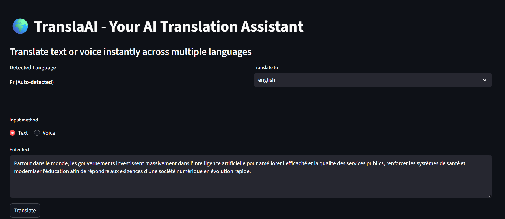
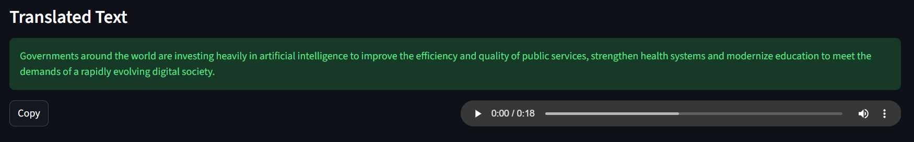
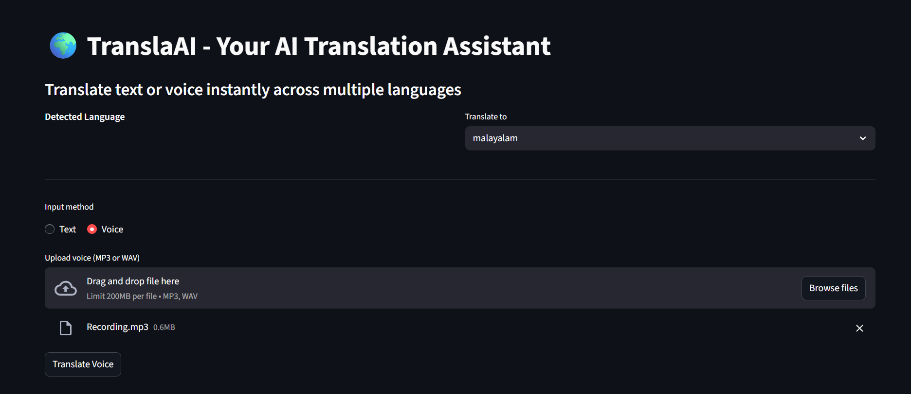
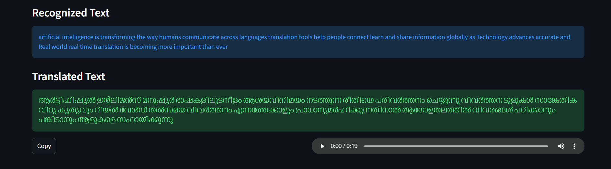
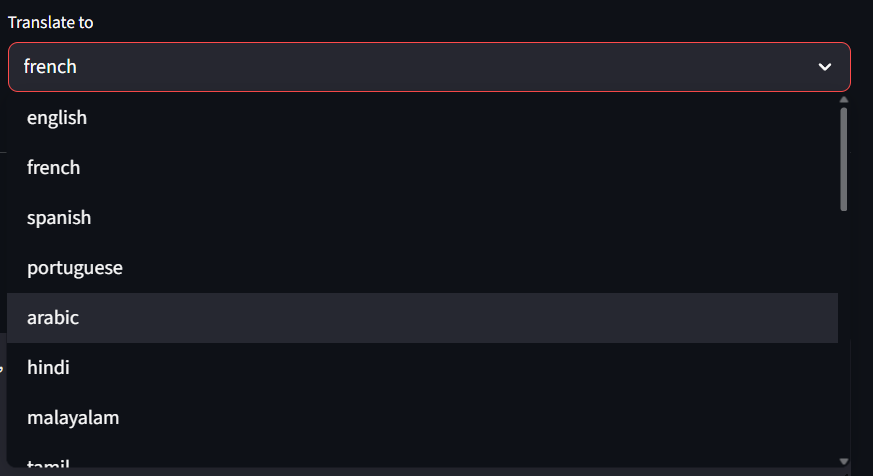

# TranslaAI – Multilingual Text & Voice Translation Assistant

## Overview

TranslaAI is an AI-powered multilingual translation application that enables users to translate both text and voice inputs into multiple languages through an intuitive, Google Translate–like interface.

The project is designed for:

- Language learners  
- Travelers  
- Content creators  
- Anyone who needs quick and accurate translations across languages  

TranslaAI automatically detects the source language, performs real-time translations, and provides audio output of the translated text. For voice input, users can upload or record speech and receive translated text along with spoken output in the target language.

In today's globalized world, communication across languages is crucial. TranslaAI bridges language barriers, making it easier to learn, work, travel, and create content across languages.

**TranslaAI focuses on delivering a smooth, user-friendly experience by combining text, voice, and audio-based translation in a single application, making multilingual communication fast, convenient, and accessible to everyone.**


---

## Key Features

TranslaAI comes with a wide range of powerful features to make translation seamless and intuitive:

- **Text Translation:** Translate text between multiple languages in real-time.  
- **Voice Translation:** Upload or record speech and receive translated text instantly.  
- **Automatic Language Detection:** Detects the source language automatically for faster translations.  
- **Audio Output:** Listen to the translated text using built-in text-to-speech functionality.  
- **Multilingual Support:** Supports a variety of popular languages for both text and voice translation.  
- **User-Friendly Interface:** Simple, clean, and intuitive interface for a smooth user experience.  
- **Real-Time Processing:** Fast translations without long waiting times.  
- **Cross-Platform Ready:** Works on web browsers, making it accessible on desktops, tablets, and mobile devices.  

---

## Demo / Examples

Here are some examples of how TranslaAI works:

### 1. Text-to-Text Translation

Users can enter text in any supported language and get an instant translation.  



*Translated from French to English*

### 2. Voice-to-Text Translation

Users can upload or record voice input and receive both translated text and spoken output.  



*Voice input in English translated to Malayalam text and audio output*

### 3. Language Selection

TranslaAI provides a dropdown menu to select the target language for translations.  

  
*Select the target language from the dropdown menu*

---

## Getting Started
### Installation

Follow these steps to set up TranslaAI on your local machine:

1. **Clone the repository**  
```bash
git clone https://github.com/shamilhussain21/TranslaAI.git
cd TranslaAI
```
2. **Set up the backend (FastAPI)**  
```bash
cd backend
python -m venv venv
source venv/bin/activate   # On Windows: venv\Scripts\activate
pip install -r requirements.txt
uvicorn main:app --reload
```
> ⚠️ Note: Ensure the backend server is running before starting the Streamlit frontend.

3. **Set up the frontend (Streamlit)**
    Open a new terminal and run:
```bash
cd frontend
python -m venv venv
source venv/bin/activate   # On Windows: venv\Scripts\activate
pip install -r requirements.txt
streamlit run app.py
```
---

## Usage

Once the application is running:

### 1. Text Translation
- Enter text in the input box.  
- Select the target language from the dropdown.  
- Click **"Translate"** to see the translation and listen to the audio output.

### 2. Voice Translation
- Upload an audio file or record your voice directly.  
- Choose the target language.  
- Click **"Translate"** to get both text and spoken translation.

### 3. Language Selection
- Use the dropdown menu to switch between languages at any time.

### 4. Real-Time Experience
- TranslaAI automatically detects the source language and provides instant translations for both text and voice inputs.

---

## Tech Stack

TranslaAI leverages a combination of AI, NLP, and web technologies to provide seamless multilingual translation:

- **Python** – Core programming language for backend logic and AI integration.  
- **Streamlit** – Framework for building the web application and interactive UI.  
- **SpeechRecognition** – Library to capture and process voice input.  
- **gTTS (Google Text-to-Speech)** – Converts translated text into audio output.  
- **Deep Translator (Google Translator)** – Performs text translation between multiple languages.  
- **pydub** – Audio processing for uploaded or recorded voice files.  
- **NLTK / SpaCy** – Natural Language Processing tools for text preprocessing (optional/enhanced translations).  
- **HTML/CSS** – For basic styling and formatting in the Streamlit interface.  
- **Python Libraries** – Such as `os`, `io`, `wave`, `pandas` for file handling and processing.

---

## Future Improvements

- **Live microphone streaming translation**
- More language support
- Offline translation support
- Speaker diarization for multi-speaker audio
- Docker deployment

---

## License
This project is licensed under the MIT License - see the [LICENSE](LICENSE) file for details.
